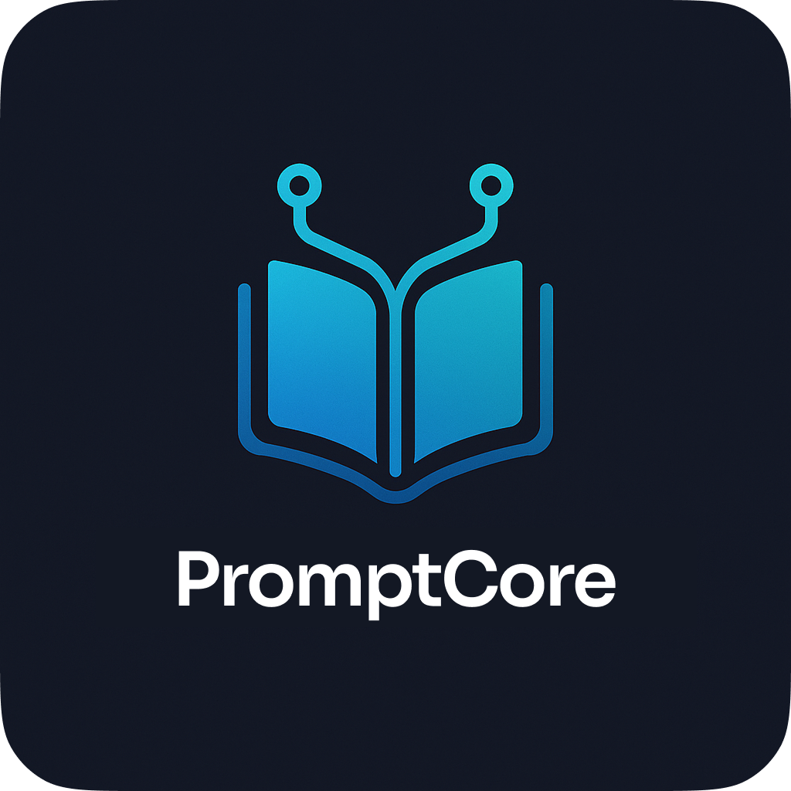

# Patterns Project


A **modern web application** for exploring, storing, and managing **AI prompt patterns**.  
Built with **vanilla JavaScript, Tailwind CSS, and modular ES6**, the app is lightweight, responsive, and ready to evolve into a full-fledged productivity tool.

---

## 🌟 Story

While exploring AI tools, I stumbled upon the amazing [Fabric framework](https://github.com/danielmiessler/Fabric) by **Daniel Miessler** — special thanks to him for sharing such a brilliant idea.
Fabric works through the terminal and is honestly far more advanced than what I've built.
However, using it requires an API key (paid), and at the time I didn't have the budget for that.

What I *did* have was access to **professionally crafted prompts** included in the Fabric repository.
They were incredibly well-structured and inspiring, but browsing them manually—opening each folder one by one and copy-pasting into an LLM—quickly became tedious.
That's when the idea for **Patterns** was born:
a free, browser-based library to **explore, search, and manage those high-quality prompts** without any paywall or API requirement.

### How It Works

* Each prompt lives in its own **folder** (the folder name is the prompt name).

* Inside each folder:

  * `system.md` holds the actual prompt
  * `description.md` and `tags.md` store metadata

* I created a Python helper, **`setup_pattern_files.py`**, to automatically generate the `description.md` and `tags.md` files for every prompt.

* Another script, **`build_prompt.py`**, compiles all prompts and metadata into a single `prompts.json` file that powers the web app.

## 🚀 Features

- Interactive UI components
- Responsive design
- Clean and modern patterns
- Easy to customize

## 📸 Screenshots

### List View


### Grid View


### Tag Filtering


## 🛠️ Technologies Used

- **Frontend**:
  - HTML5
  - JavaScript (ES6+)
  - [Tailwind CSS](https://tailwindcss.com/) - Utility-first CSS framework
  - [Iconify](https://iconify.design/) - Icon library
- **Build Tools**:
  - Python 3.x (for build scripts)
- **Version Control**:
  - Git

## 🏃‍♂️ Getting Started

### Prerequisites

- A modern web browser (Chrome, Firefox, Safari, Edge)
- Python 3.x (for build scripts)
- (Recommended) A local web server (like Live Server in VS Code or Python's built-in server)

### Installation

1. Clone the repository:
   ```bash
   git clone https://github.com/TomceGraphics/Prompt-Library.git
   cd Prompt-Library
   ```

2. Run a local server (choose one method):

   **Option 1: Using VS Code (Recommended)**
   - Install the "Live Server" extension
   - Right-click on `index.html` and select "Open with Live Server"

   **Option 2: Using Python**
   ```bash
   # Python 3.x
   python -m http.server 8000
   # or
   python3 -m http.server 8000
   ```
   Then open `http://localhost:8000` in your browser

## Adding New Patterns

To add your own patterns:

1. Create a new folder inside `patterns` (name it after the prompt).
2. Add:

   * `system.md` → the prompt itself
   * `description.md` → a short description
   * `tags.md` → tags for filtering
3. Run `build_prompt.py` to rebuild the `prompts.json`.

For convenience, you can also use the **`create_pattern`** prompt to automate some of these steps.

## 📁 Project Structure

```
Prompt-Library/
├── assets/
│   ├── images/          # Project images and icons
│   ├── scripts/         # JavaScript files
│   │   ├── app.js       # Main application logic
│   │   ├── json.js      # JSON data handling
│   │   └── modules/     # Modular JavaScript components
│   └── styles/          # CSS files
│       └── sidebar.css  # Sidebar-specific styles
├── patterns/            # Individual prompt folders
│   ├── pattern_name_1/
│   │   ├── system.md      # The actual prompt
│   │   ├── description.md # Description of the prompt
│   │   └── tags.md        # Tags for filtering
│   └── ...
├── python/              # Python build scripts
│   ├── build_prompt.py     # Builds prompts.json
│   └── setup_pattern_files.py # Helper for setting up new patterns
├── index.html           # Main HTML entry point
└── README.md           # Project documentation
```

## 🎨 Customization

- **Styling**: 
  - Customize colors and theme in the `tailwind.config.js` section of `index.html`
  - Add custom styles in `assets/styles/`
  - Use Tailwind's utility classes directly in your HTML

- **Functionality**:
  - Main application logic is in `assets/scripts/app.js`
  - JSON handling is in `assets/scripts/json.js`
  - Add new modules in `assets/scripts/modules/`

- **Adding Patterns**:
  - Follow the structure in the "Adding New Patterns" section
  - Run `python build_prompt.py` after adding new patterns

## Planned Features

### High Priority
- [x] Side panel with categories and favorites
- [ ] Database migration (replace JSON files)
- [ ] UI for pattern creation/editing  
- [ ] In-app pattern management (edit descriptions, tags, etc.)

### Future Considerations  
- [ ] Advanced sorting and filtering

## 🤝 Contributing

Contributions are welcome! Please feel free to submit a Pull Request.

## 📄 License

This project is open source and available under the [MIT License](LICENSE).

---

Made with ❤️ by Thomas Graphics
