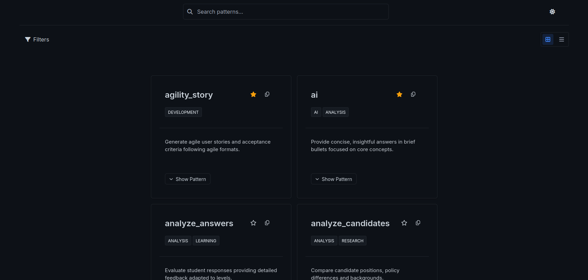

# Patterns Project

A modern web application showcasing various UI patterns and components built with HTML, CSS, and JavaScript.

## 🚀 Features

- Interactive UI components
- Responsive design
- Clean and modern patterns
- Easy to customize

## 📸 Screenshots

### List View


### Grid View


### Tag Filtering


## 🛠️ Technologies Used

- HTML
- CSS
- JavaScript

## 🏃‍♂️ Getting Started

### Prerequisites

- A modern web browser (Chrome, Firefox, Safari, Edge)
- (Recommended) A local web server (like Live Server in VS Code or Python's built-in server)

### Installation

1. Clone the repository:
   ```bash
   git clone https://github.com/TomceGraphics/Prompt-Library.git
   cd Prompt-Library
   ```

2. Run a local server (choose one method):

   **Option 1: Using VS Code (Recommended)**
   - Install the "Live Server" extension
   - Right-click on `index.html` and select "Open with Live Server"

   **Option 2: Using Python**
   ```bash
   # Python 3.x
   python -m http.server 8000
   # or
   python3 -m http.server 8000
   ```
   Then open `http://localhost:8000` in your browser

   **Option 3: Direct file access**
   - Simply open `index.html` in your browser (note: some features might be limited due to CORS restrictions)

## 📁 Project Structure

```
Prompt-Library/
├── index.html      # Main HTML file
├── style.css      # Main stylesheet
└── main.js        # JavaScript functionality
```

## 🎨 Customization

- Modify `style.css` to change the appearance
- Update `main.js` to add or modify functionality
- Edit `index.html` to change the structure

## Adding New Patterns

Currently, patterns are added via a manual process (a UI for this is planned):

1. **Create a folder** with the pattern name in the patterns directory
2. Add a `system.md` file inside containing the pattern's content
3. Create a `description.json` file with:
   ```json
   {
     "description": "Your pattern description",
     "tags": ["tag1", "tag2"]
   }
   ```
4. Run the Python script to generate the final JSON structure

Use the `create_pattern` custom pattern to automate some of these steps.

## Planned Features

### High Priority
- [ ] Database migration (replace JSON files)
- [ ] Side panel with categories and favorites
- [ ] UI for pattern creation/editing  
- [ ] In-app pattern management (edit descriptions, tags, etc.)

### Future Considerations  
- [ ] User accounts system
- [ ] Version history for patterns
- [ ] Advanced sorting and filtering

## 🤝 Contributing

Contributions are welcome! Please feel free to submit a Pull Request.

## 📄 License

This project is open source and available under the [MIT License](LICENSE).

---

Made with ❤️ by Thomas Graphics
